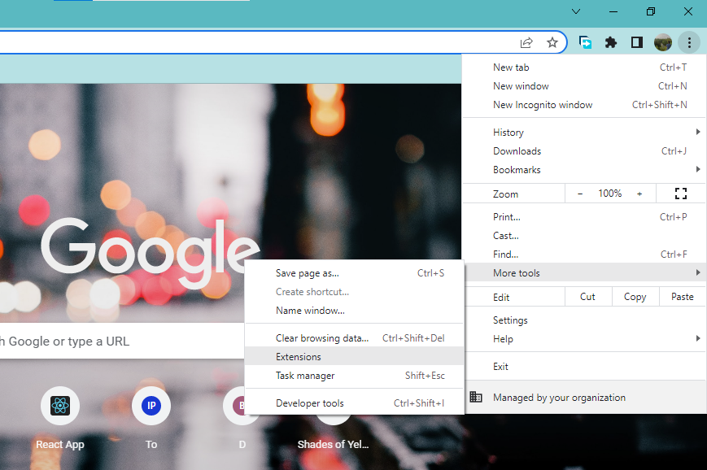
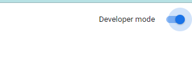
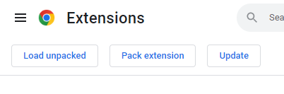
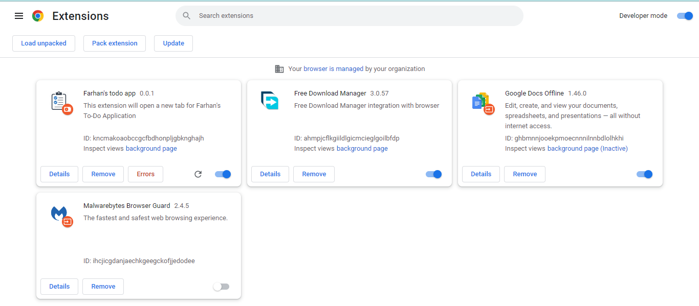
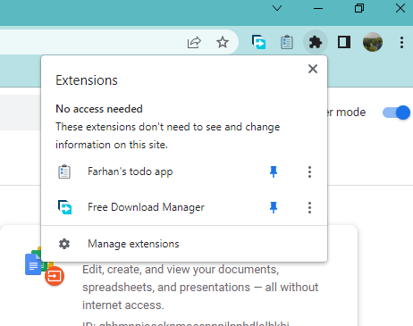
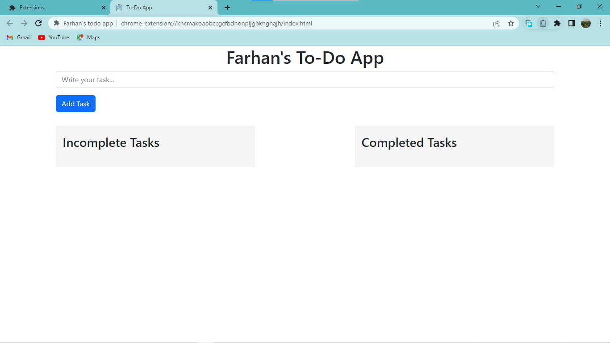
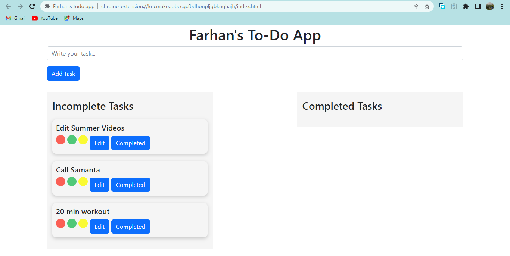
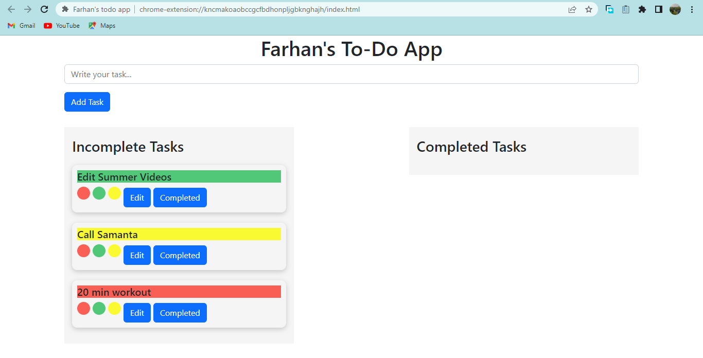
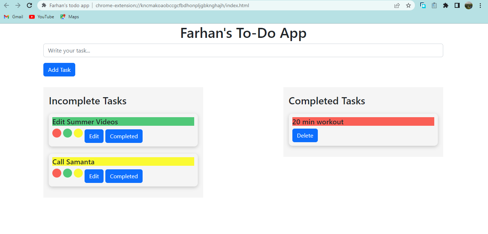
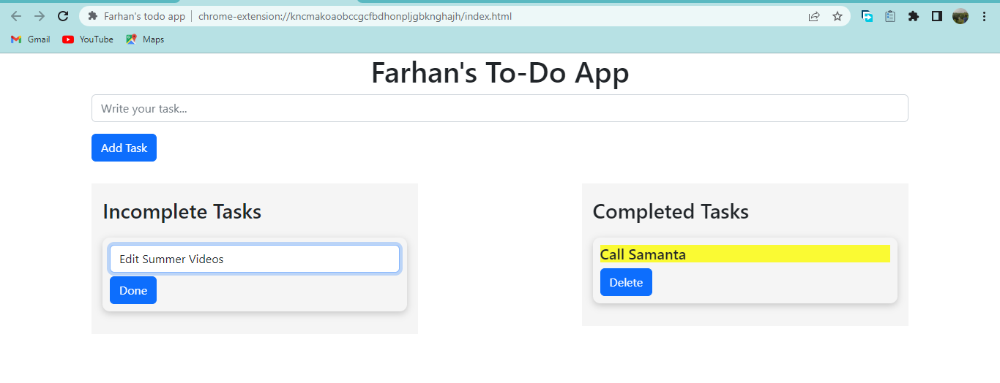

# Farhan's Todo App 
Easily distracted when using a browser? Use a todo app as extension to be focused. 

It's a simple todo app, made to use as chrome extension. Only vanilla JavaScript and Dom manipulation is being used along with HTML and CSS to make this app.

## Features

- Could be used as Chrome Extension
- Separate list for incomplete and completed tasks
- User can mark their task by different color
- User can edit their tasks
- Day and night mode
- No database operation. We don't save your task anywhere. When you close your tab or browser, the app will erase all the data.

## How to use it as chrome extension?
Do you want to add this todo app in your chrome browser as an extension? Follow the following procedure...

### Step 1
Download this repository, unzip it and save it in your local device.

### Step 2 
Go to you chrome browser and select "more tools" by clicking three dots from the top right corner. From "More tools" , select "Extensions".

### Step 3 
Turn on developer mode from top right corner.

### Step 4
Click "Load unpacked" and select the folder which was downloaded in Step 1. 

### Step 5
Now, you can see the app named "Farhan's todo app" is successfully added in your browser extensions. 

### Step 6
To "pin" this extension, click the extensions icon from top right bar, and pin "Farhan's todo app"

### Step 7
Click the "Farhan's todo app" extension's icon, from the pinned extension list. It will open a new tab and you can use the app. 

### Step 8 
You can add as many tasks as you like and you can mark your tasks in different color. If you complete a task, click the complete button and the task will go to the "Completed Tasks" section. You can delete tasks from that section. You can also edit your task.

